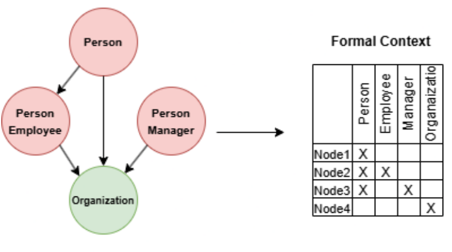
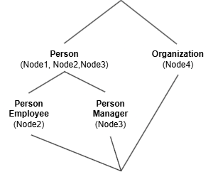

# FCA-Based Schema Discovery for Property Graphs  

This repository contains the implementation of an **automatic schema discovery method** for *property graphs*, leveraging **Formal Concept Analysis (FCA)**. Developed as part of a masters thesis, this approach systematically extracts schema information from property graphs using the [FCApy](https://github.com/EgorDudyrev/FCApy) library.  
## Overview  

The method takes a property graph as input and constructs a **formal context**, where nodes act as objects and their labels, properties, or both serve as attributes. Using FCA, the method generates a **concept lattice**, which is then transformed into a schema. The extracted schema considers each concept in the lattice as a node type, while superconcept relations are interpreted as supertype relationships. The extent of each concept can be used to determine which nodes belong to which type. The method then analyzes the input graph further to identify all labels and properties associated with the extracted types.  

To refine the schema, the method compares the extracted types using the **Jaccard Similarity**. If types are highly similar, they can be merged to detect more general and meaningful types. By adjusting thresholds in the configuration file, users can also filter out outliers in case of erroneous data. Additionally, the method supports the detection of **abstract types** among node types. After extracting the node types, another formal context is built for the edges, treating them as objects with attributes based on their labels, properties, or both. The same FCA-based approach is applied, and source and target endpoint types are determined based on the previously extracted node types. The resulting schema follows the **PG-Schema** language proposed by [Angles et al. (2022)](https://dl.acm.org/doi/pdf/10.1145/3589778).  

## Example  

The following image shows a simple property graph consisting of four nodes with labels. For this example, we disregard properties and edges. The formal context is built by treating the nodes as objects and their labels as attributes.  



The corresponding concept lattice, derived from this formal context, is shown below. It serves as the foundation for extracting a schema.  

  

Based on this lattice, we can directly translate the concepts into types and construct a schema in **PG-Schema** format:  

```sql
CREATE GRAPH TYPE ResultGraphType STRICT {
    (PersonType: Person {"potential properties"}),
    (EmployeeType: PersonType & Employee {"potential properties"}),
    (ManagerType: PersonType & Manager {"potential properties"}),
    (OrganizationType: Organization {"potential properties"})
}
```

## Method

Read this section to get an understanding of how the method operates and to help you adjust the parameters.
### Input
To use this method, ensure that you have a running Neo4j instance containing a property graph. The connection details, including the URI and authentication credentials, should be specified in the ``config.json`` file. Alternatively, for experimental purposes, users can enable graph generation by setting `graph_generator` to ``true``. In this case, the method will ignore the ``data_source`` setting and generate a graph according to the schema specified in ``graph_generator_schema_path``.

The repository is designed for easy extension to support other data sources beyond Neo4j. Developers only need to implement the necessary query logic and convert the retrieved graph data into the internal structure used by the method.

### Type Extraction
The schema extraction process relies on Formal Concept Analysis to construct a formal context from graph data and generate a concept lattice. Users can specify how node and edge types are extracted by selecting ``label_based``, ``property_based``, or ``label_property_based`` methods. The attributes chosen for constructing the formal context will influence the resulting schema structure.

For nodes and edges, the method examines the assigned instances and determines their labels, properties, and relationships. If ``optional_labels`` or ``optional_properties`` are enabled, attributes that are not universally present in all instances of a type may still be included as optional. However, if these options are disabled, the resulting schema will be strict, meaning that only attributes that appear in all instances will be retained.

To prevent overfitting and reduce noise, the ``type_outlier_threshold`` parameter can be adjusted. This threshold defines the minimum number of occurrences required for a type to be considered valid. Lowering this threshold allows more specific types to emerge, while increasing it filters out less significant types and potential outliers.

Since the initial concept lattice may be overly complex, the method applies type merging based on similarity. If two types have a superconcept relationship in the lattice and their weighted Jaccard similarity exceeds the ``merge_threshold``, they are merged into a more general type. If a user prefers to limit the number of extracted types, they can set ``max_types`` to ``true`` and define the maximum number of node and edge types using ``max_node_types`` and ``max_edge_types`` and the types will be merged until the requirement is satisfied.

The method also supports abstract type detection. If ``abstract_type_lookup`` is enabled, the method searches for similar node types and, if their similarity exceeds the ``abstract_type_threshold``, it creates an abstract type representing their shared attributes.

### Validation

If ``validate_graph`` is set to ``true``, the input graph will be checked for conformance against the extracted schema. Nodes and edges that do not conform will be listed in ``invalid_elements.json`` in the output directory for further inspection. The schema's strictness affects validation results. If ``optional_labels`` and ``optional_properties`` are disabled, a graph may fail validation if it contains additional attributes beyond those specified in the schema. Users can fine-tune the validation criteria by adjusting the threshold parameters.

The PG-Schema language allows defining whether a type is open for additional labels and properties. If a type is open, an entity of that type must have the specified attributes but can also include additional ones. If a type is closed, an entity is valid only if it matches the exact specification. These settings must be manually configured with ``open_labels`` and ``open_properties`` based on the intended use case.

### Schema Merging

If schema discovery is performed across multiple graphs, users can provide an existing schema as input. The extracted schema will then be merged with this schema, allowing similar types to be unified and new relationships to be incorporated. The resulting schema ensures that if a graph was valid under one of the original schemas, it will also be valid under the merged schema.

To enable schema merging, set ``merge_schema`` to ``true`` and specify the schema file in ``schema_to_merge_path`` (Note that the schema has to be in PG-Schema format and the |-operator for labels and constraints in general are not allowed). The ``schema_merge_threshold`` parameter controls how similar two types must be to be considered the same in the merged schema. By iteratively extracting and merging schemas from multiple graph instances, users can derive a more generalized schema that encompasses all variations found across datasets.

### Output  

The method produces several output files:  

- **PG-Schema**: The primary output is a schema for the input property graph, formatted according to **PG-Schema**.  
- **Graph-Entity to Schema-Type Mapping**: If a valid schema is produced, a JSON file will map each node and edge to its corresponding schema type.  
- **Invalid Elements**: If any nodes or edges do not conform to the extracted schema, they will be listed in an output file for further evaluation.  
- **Concept Lattice Visualization**: A graphical representation of the concept lattices generated during schema extraction is included.  
- **Merged Schema**: If an input schema is provided for merging, the output will contain a combined schema integrating the predefined structure with the newly identified elements.  

## Installation & Usage  

Clone the repository and set up a virtual environment. The implementation is compatible with **Python 3.10 and later**. Install the required dependencies using:  

```sh
pip install -r requirements.txt
```

Adjust the parameters in the config.json file and run the main script.

## Configuration  
  
The configuration file allows you to control how schemas are extracted. Below is a list of the parameters:  
  
| *Parameter* | *Type* | *Description* | *Default Value* |
|--------------|---------|----------------|----------------|
| data_source | str | Specifies the source of the data. Currently, only neo4j is supported. | neo4j |
| neo4j.uri | str | URI for connecting to the Neo4j database. | bolt://localhost:7687 |
| neo4j.username | str | Username for authentication. | neo4j |
| neo4j.password | str | Password for authentication. | password |
| graph_generator | bool | Enables or disables graph generation mode. | false |
| graph_generator_schema_path | str | Path to the schema file used for graph generation. | None |
| graph_generator_max_entities | int | Maximum number of entities to generate per type. | 100000 |
| graph_generator_min_entities | int | Minimum number of entities to generate per type. | 10000 |
| node_type_extraction | str | Method for extracting node types (label_based, property_based or label_property_based). | label_based |
| edge_type_extraction | str | Method for extracting edge types (label_basaed, property_based or label_property_based). | label_based |
| optional_labels | bool | Includes optional labels in the schema. | true |
| optional_properties | bool | Includes optional properties in the schema. | true |
| type_outlier_threshold | int | Minimum number of nodes/edges required for a type to be valid. | 5 |
| label_outlier_threshold | int | Minimum number of elements containing a label for validity. | 5 |
| property_outlier_threshold | int | Minimum number of elements containing a property for validity. | 5 |
| endpoint_outlier_threshold | int | Minimum number of edges involving a source/target node type for validity. | 5 |
| merge_threshold | float | Similarity threshold for merging types. | 0.6 |
| remove_empty_types | bool | Removes types with no nodes/edges assigned. | true |
| max_node_types | int | Maximum number of node types in the schema. | 0 |
| max_edge_types | int | Maximum number of edge types in the schema. | 0 |
| max_types | bool | Enables type merging to conform to max allowed types. | false |
| abstract_type_threshold | float | Threshold for creating abstract types from shared attributes. | 0.6 |
| abstract_type_lookup | bool | Enables lookup for abstract types. | false |
| graph_type_name | str | Name of the graph type. | ResultGraphType |
| out_dir | str | Directory to save results. | None |
| validate_graph | bool | Enables graph validation against schema. | true |
| open_labels | bool | Permits labels not defined in the schema. | false |
| open_properties | bool | Permits properties not defined in the schema. | false |
| merge_schema | bool | Enables schema merging. | false |
| schema_to_merge_path | str | Path to schema file for merging. | None |
| schema_merge_threshold | float | Similarity threshold for merging entities. | 0.5 |
